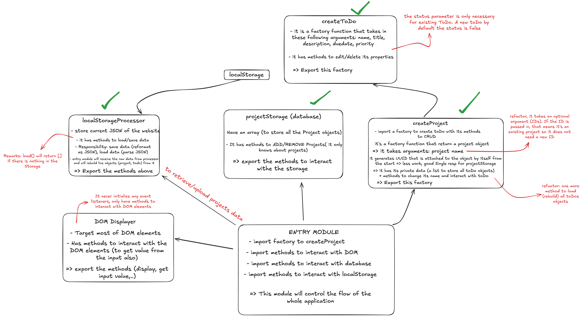

# Todo-List

A simple to-do list app with a pixel-art UI. Organize tasks into projects, set
priorities and due dates, and have everything persist across page reloads.

This project was built to learn **JSON**, the **localStorage API**, and the
**architecture of a CRUD app** ( how to structure create / read / update /
delete logic cleanly and keep the data layer separate from the UI ).

## Tech Stack

- HTML
- CSS (pixel-art styling)
- JavaScript
- Webpack
- JSON
- localStorage API

## Architecture




## Getting Started

```bash
npm install     # install dependencies
npm run dev     # start the dev server
npm run build   # production build
```

## Reflection

Lessons learned while building this project are kept in
[`reflection.md`](./reflection.md) to keep this README focused.

The biggest takeaway was **event delegation**: instead of attaching a listener
to every child element, attach a single listener to the static parent container
and use `.closest()` to find which child was actually clicked. This keeps
dynamically-created elements working without rebinding, and avoids a pile of
repetitive listener code. The reflection also covers other architecture
decisions made along the way.
